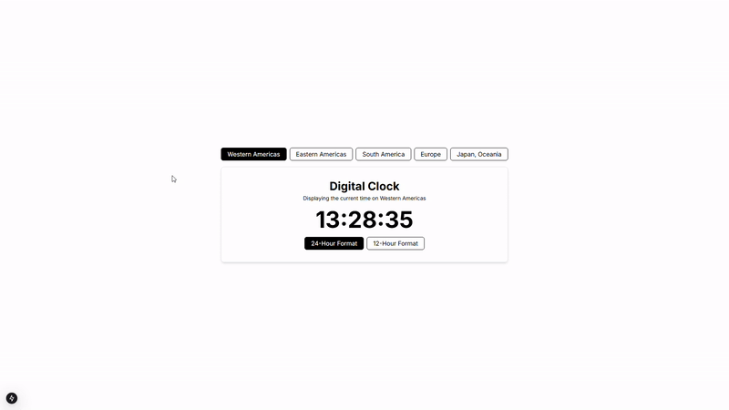

<h1>
   Digital Clock
</h1>



## 🧾 Sobre

Relógio digital funcional com diferentes regiões para monitoramento do horário atual.

## 💻 Tecnologias utilizadas

- Next.js
- Tailwind CSS
- TypeScript
- Luxon

## 🛠️ Como utilizar

Instale as dependências do projeto:

```bash
npm install
```

Inicie o projeto:

```bash
npm run dev
```

Por fim, abra [http://localhost:3000](http://localhost:3000) no seu navegador.
